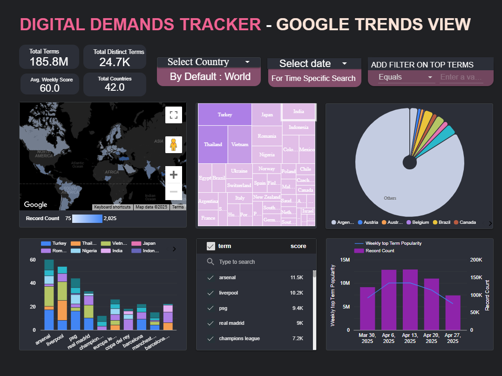

# Globe Trends

A data pipeline for analyzing trending search topics across 42 countries, designed to help businesses track digital popularity patterns and optimize marketing strategies.

## Google Trends Dashboard Pipeline

### Insights
This project implements an end-to-end data pipeline on Google Cloud Platform that processes Google Trends data through an ELT pipeline and delivers insights via an interactive Looker Studio dashboard. The infrastructure is managed with Terraform, workflows are orchestrated with Kestra, data transformations are handled by dbt, and visualizations are powered by Looker Studio.

### Dashboard Preview
The Looker Studio dashboard provides visualization of global and country-specific Google Trends data, highlighting trending search terms to help businesses with market analysis and SEO optimization.


[Looker Studio Dashboard](https://lookerstudio.google.com/reporting/678132ee-126d-4297-8635-9d6ffdf06603)

## Table of Contents

- [Project Overview](#project-overview)
- [Problem Statement](#problem-statement)
- [Technology Stack](#technology-stack)
- [System Architecture](#system-architecture)
- [Implementation Components](#implementation-components)
- [Project Structure](#project-structure)
- [Deployment Guide](#deployment-guide)
- [Technical Implementation](#technical-implementation)
- [Performance Optimization](#performance-optimization)
- [Security Measures](#security-measures)
- [Results and Outputs](#results-and-outputs)
- [Troubleshooting Guide](#troubleshooting-guide)
- [Roadmap](#roadmap)
- [References](#references)

## Project Overview

**Project Title:** Globe Trends: Global Search Interest Analysis Pipeline

**Objective:** To build a scalable data pipeline that processes Google Trends data to identify search patterns, analyze temporal trends, and provide actionable business insights through visualization.

## Problem Statement

The original Google Trends data presents several challenges for business users:
1. Designed for general users rather than business analysis
2. Fragmented across time periods and geographical regions
3. Requires complex queries for meaningful insights
4. Lacks integrated visualization of multi-dimensional data

This solution addresses these limitations by:
1. Creating a business-focused analytical pipeline
2. Unifying data structure for efficient querying
3. Normalizing search metrics across regions and time
4. Providing intuitive trend visualizations

## Technology Stack

| Component | Technology | Purpose |
|-----------|------------|---------|
| Cloud Platform | Google Cloud Platform | Hosting and data processing services |
| Infrastructure | Terraform | GCP resource provisioning and management |
| Orchestration | Kestra | Workflow scheduling and execution |
| Data Lake | Google Cloud Storage | Raw data storage and archival |
| Data Warehouse | BigQuery | Analytical data processing and storage |
| Transformations | dbt | Data modeling and transformation |
| Visualization | Looker Studio | Business intelligence and dashboards |
| Development | SQL, YAML, Terraform HCL | Implementation languages |

## System Architecture

The pipeline follows this processing flow:
1. Infrastructure provisioning via Terraform
2. Data extraction from Google Trends Public Dataset
3. Loading raw data into partitioned BigQuery tables
4. Data transformation using dbt models
5. Visualization through Looker Studio dashboards


### Architecture Layers

1. **Infrastructure Management**
   - Terraform-managed GCP resources
   - BigQuery datasets for staging and analytics
   - IAM permissions for service accounts

2. **Data Ingestion**
   - Kestra workflows extracting public dataset
   - Initial loading to BigQuery staging tables

3. **Data Processing**
   - Data cleaning and standardization
   - Dimensional modeling with dbt

4. **Analytical Storage**
   - Partitioned fact tables
   - Optimized materialized views

5. **Data Presentation**
   - Direct BigQuery connectivity
   - Interactive dashboard components

## Implementation Components

### 1. Infrastructure Provisioning
Terraform modules manage:
- BigQuery datasets (trends_raw, trends_processed)
- IAM roles for service accounts
- GCS buckets for temporary storage

Key files:
- `main.tf`: Core infrastructure definition
- `variables.tf`: Configuration parameters

### 2. Workflow Orchestration
Kestra handles:
1. Scheduled data extraction
2. Raw data loading to BigQuery
3. dbt transformation triggering

Workflow definition:
- `trends_ingest.yml`: Main pipeline workflow

### 3. Data Pipeline
ELT process stages:
- **Extract**: From Google Trends Public Dataset
- **Load**: To partitioned BigQuery tables
- **Transform**: Using dbt models

### 4. Data Modeling
dbt transformation layers:
- Staging: Data cleaning and validation
- Intermediate: Business logic implementation
- Mart: Analytical data models

### 5. Analytical Storage
Optimized BigQuery tables:
- `trends_raw.search_data`: Source data
- `trends_processed.fact_trends`: Analysis-ready data

### 6. Data Visualization
Dashboard features:
- Temporal trend analysis
- Geographic interest distribution
- Search term comparisons
- Related queries analysis

## Project Structure
## Folder Structure

- `dbt/`: dbt models for Data Warehouse transformations
  - `dim_region_top_terms.sql`: Regional trending terms dimension
  - `dim_trends_daily.sql`: Daily trends dimension
  - `dim_trends_weekly.sql`: Weekly trends dimension  
  - `facts_trends_daily.sql`: Daily trend metrics
  - `facts_trends_weekly.sql`: Weekly trend metrics
  - `staging_trends_table.sql`: Initial data cleaning
- `docker/`: Docker configuration for Kestra
  - `Dockerfile`: Container setup
  - `gcp_setup.yml`: GCP service configuration
- `flows/`: Kestra workflow definitions
  - `trends_ingest.yml`: Main data pipeline
- `terraform/`: Infrastructure as code
  - `main.tf`: Core infrastructure
  - `variables.tf`: Configuration parameters
- `images/`: Documentation assets
- `README.md`: Project documentation

## Project Components

### 1. Infrastructure (Terraform)
Terraform provisions and manages:
- BigQuery datasets (`trends_raw`, `trends_processed`)
- IAM roles for service accounts
- Cloud Storage buckets

Key files:
- `main.tf`: Infrastructure definition
- `variables.tf`: Configuration variables

### 2. Orchestration (Kestra)
Kestra workflows:
1. Extract from Google Trends Public dataset
2. Load to BigQuery staging
3. Trigger dbt transformations

Workflow files:
- `gcp_setup.yml`: Service configuration
- `gcp_trends.yml`: Main pipeline

### 3. Data Pipeline
ELT process:
- **Extract**: From public dataset
- **Load**: To `trends_tables` tables
- **Transform**: Via dbt models

### 4. Data Transformations (dbt)
Model layers:
- Staging: `staging_trends_table.sql`
- Dimensions: `dim_*.sql` files
- Facts: `facts_*.sql` files

### 5. Analytics (BigQuery)
Tables:
- Raw: `bigquery-public-data.google_trends.international_top_rising_terms`
- Processed: `trends_tables` 
- Optimized with partitioning

### 6. Visualization (Looker Studio)
Features:
- Time-series trends
- Geographic heatmaps
- Term comparisons

## Setup Instructions

### Prerequisites
- GCP account with billing
- Google Trends dataset access
- Terraform, gcloud CLI, dbt installed

### Deployment

## Deployment Guide

1. Infrastructure setup:


### 1. Kestra Setup with Docker

1. Start the Kestra container with PostgreSQL and Terrform:
    ```bash
    docker-compose up -d
    ```

    Access the Kestra UI:  
    http://localhost:8080
   
   also generate all required Google Setups 
```bash
cd terraform
terraform init
terraform apply

```
2. Import Workflow Files
    ```bash
    cd ./kestra
    curl -X POST http://localhost:8080/api/v1/flows/import -F fileUpload=@flows/gcp_setup.yaml
    curl -X POST http://localhost:8080/api/v1/flows/import -F fileUpload=@flows/gcp_trends.yaml
    ```

3. GCP Configuration  
    Set up credentials in Kestra:

    - Go to **Settings → Secrets** in Kestra UI  
    - Add your GCP service account JSON key  

    Configure required parameters:
    - `project_id`: Your GCP project ID  
    - `bucket_name`: Existing storage bucket name  

    Required IAM permissions:
    - BigQuery Admin  
    - Cloud Storage Admin  
    - Service Account User

4. Execute the Kestra Flow  
    - Navigate to **Flows** in Kestra UI  
    - Select and run the imported workflows

5. dbt Setup and Execution
    ```bash
    cd dbt
    ```

    Install dependencies:
    ```bash
    dbt deps
    ```

    Build the data models:
    ```bash
    dbt build
    ```

6. Looker Studio Dashboard Setup

    - Connect to BigQuery  
    - Create new Looker Studio report  
    - Add all generated tables:  
        - Dimension tables (`dim_*`)  
        - Fact tables (`facts_*`)  

    - Build your dashboard:  
        - Create visualizations  
        - Configure filters and time ranges  
        - Customize the layout  

### Important Notes

- Ensure Docker is running before starting containers  
- Verify all network connections between services  
- Check Kestra logs for execution details  
- The existing bucket must have proper IAM permissions


